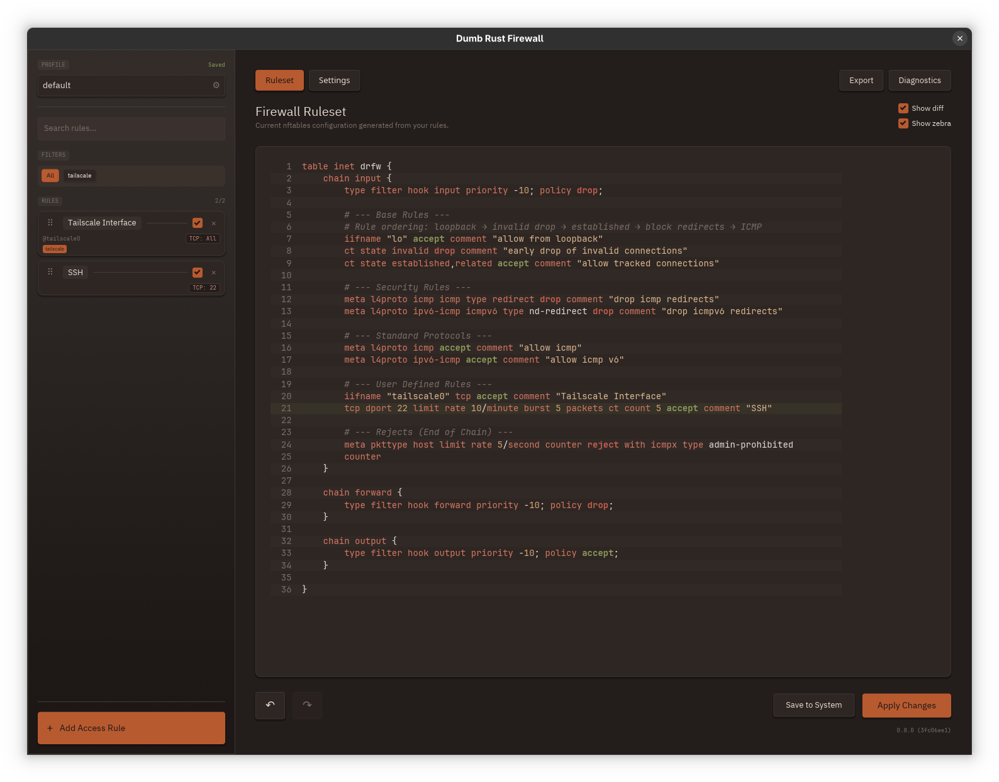

# DRFW — Dumb Rust Firewall

A minimal, safe, stateful nftables GUI for desktop Linux.

<p align="center">
  <a href="https://github.com/ledati16/drfw/actions/workflows/ci.yml"></a>
  <a href="LICENSE"></a>
  <a href="https://www.rust-lang.org/"></a>
  <a href="Cargo.toml#L9-L34"></a>
  <a href="https://github.com/iced-rs/iced"></a>
  <a href="#appendix-llm-generated-code"></a>
</p>

## Philosophy

DRFW follows the "dumb firewall" principle: **explicit is better than implicit**. No magic, no auto-detection, no surprises. You control exactly what's allowed through your firewall.

- **GUI-first**: Simple, focused interface for managing firewall rules
- **JSON-first**: Uses nftables' JSON API exclusively (no shell interpolation, no command injection risks)
- **Safety-first**: Automatic snapshots, pre-apply verification, and dead-man switch with auto-revert
- **Desktop-friendly**: Conservative defaults that work out-of-the-box for most users

## Screenshots

<p align="center">
  
</p>

## Features

### Core Functionality
- **Add/edit/delete firewall rules** via clean GUI
- **Protocol filtering**: TCP, UDP, TCP+UDP, ICMP (v4), ICMPv6, ICMP (both), or Any
- **Port matching**: Single port, range (`8000-8080`), or multiple (`22, 80, 443, 8000-8080`)
- **Source/Destination IP filtering**: Allow traffic from/to specific networks (CIDR notation, multiple IPs per rule)
- **Interface filtering**: Exact match (`eth0`) or wildcards (`docker*`, `veth*`)
- **Rule reordering**: Drag-and-drop to change rule priority
- **Enable/disable toggles**: Disable rules without deleting them
- **Tag-based organization**: Add multiple tags per rule, filter by tag
- **Search**: Real-time fuzzy search across all rule fields

### Advanced Rule Options
- **Action types**: Accept, Drop, or Reject (with type: port-unreachable, host-unreachable, admin-prohibited, tcp-reset)
- **Rate limiting**: Per-rule rate limits with optional burst (e.g., `5/minute burst 10`)
- **Connection limiting**: Max simultaneous connections per rule
- **Per-rule logging**: Toggle to log matched packets with auto-generated prefix
- **Chain selection**: Input or Output (Output only in Server Mode)
- **Output interface**: Filter outbound traffic by interface (Server Mode only)

### Safety Features
- **Pre-apply verification**: `nft --check` validates syntax before applying
- **Automatic snapshots**: Captures current ruleset before every apply
- **Dead-man switch**: Configurable countdown (5-120s) with auto-revert if not confirmed
- **Manual revert**: One-click restore to previous snapshot
- **Undo/Redo**: Full history for all rule modifications (Ctrl+Z / Ctrl+Shift+Z)

### Default Protection (Always On)
DRFW is a **stateful firewall** with sensible defaults that require no configuration:

| Rule | Purpose |
|------|---------|
| Allow loopback | Local services always work (`127.0.0.1`) |
| Drop invalid packets | Malformed connections rejected early |
| Allow established/related | Return traffic for your connections works automatically |
| Block ICMP redirects | Prevents classic MITM attacks |
| Allow ICMP | Ping and network diagnostics work |
| Default deny | Everything else is blocked (INPUT chain) |

These base rules are **not configurable** — they represent security best practices that 99%+ of users need. Without stateful filtering, you'd need explicit rules for every connection's return traffic.

### Advanced Security Settings
All disabled by default for maximum compatibility:

| Setting | Purpose | Warning |
|---------|---------|---------|
| **Strict ICMP** | Allow only ping + MTU discovery | Breaks network diagnostics |
| **ICMP Rate Limiting** | Prevent ping floods | May affect monitoring tools |
| **Anti-spoofing (RPF)** | Drop packets with spoofed source IPs | **Breaks Docker, VPNs, complex routing** |
| **Dropped Packet Logging** | Log filtered traffic to syslog | Can fill logs quickly |
| **Server Mode** | Block all outbound by default | Requires explicit egress rules |

### User Experience
- **27 color themes**: Oxide, Dracula, Tokyo Night, Catppuccin, Nord, Gruvbox, Monochrome, and more
- **Accessibility options**: Monochrome theme and reduced syntax colors mode (2-level highlighting)
- **Custom fonts**: Select UI and monospace fonts from system fonts
- **Live preview**: Syntax-highlighted nftables output
- **Diff view**: See exactly what changes before applying
- **In-app notifications**: Success, warning, and error banners
- **Diagnostics viewer**: Built-in audit log browser with filtering
- **Keyboard shortcuts**: Ctrl+N (new rule), Ctrl+S (apply), Ctrl+E (export), F1 (help)

### Profile Management
- **Multiple profiles**: Save different rule configurations
- **Quick switching**: Change profiles with unsaved-changes detection
- **Import/Export**: Export as nftables text or JSON

### CLI Interface
Full command-line support for scripting and automation:

```bash
drfw              # Launch GUI
drfw --help       # Show all commands
drfw list         # List all profiles
drfw status       # Show active profile and rule count
drfw apply <profile>                 # Apply with 15s auto-revert safety
drfw apply <profile> --confirm 30    # Apply with 30s timeout
drfw apply <profile> --no-confirm    # Apply permanently (no safety net)
drfw export <profile> --format nft   # Export as nftables text
drfw export <profile> --format json  # Export as JSON
```

## Installation

### Prerequisites

**Required:**
- Linux kernel 4.14+ with nftables support
- `nftables` package installed
- Privilege escalation: `run0` (systemd v256+), `sudo`, or `pkexec`
- Rust 1.92 (2024 edition) — Install via [rustup](https://rustup.rs)

**Check nftables:**
```bash
nft --version
```

**Install nftables:**
```bash
# Arch Linux
sudo pacman -S nftables

# Debian/Ubuntu
sudo apt install nftables

# Fedora
sudo dnf install nftables

# openSUSE
sudo zypper install nftables
```

### Building from Source

```bash
git clone https://github.com/ledati16/drfw.git
cd drfw
cargo build --release
./target/release/drfw
```

### System-wide Installation

```bash
sudo cp target/release/drfw /usr/local/bin/
drfw
```

## Usage

### Basic Workflow

1. **Launch DRFW**: `drfw`
2. **Add a rule**: Click **[+ Add Rule]**, configure protocol/port/source/interface
3. **Preview**: View syntax-highlighted nftables output in the preview pane
4. **Apply**: Click **[Apply]** — DRFW verifies, snapshots, then applies with elevation
5. **Confirm**: Click **[Confirm]** within the countdown, or rules auto-revert

### Example Rules

**Allow SSH:**
- Protocol: TCP, Port: `22`

**Allow web server (HTTP + HTTPS in one rule):**
- Protocol: TCP, Port: `80, 443`

**Allow Minecraft from LAN only:**
- Protocol: TCP, Port: `25565`, Source: `192.168.1.0/24`

**Allow all Tailscale VPN traffic:**
- Protocol: Any, Interface: `tailscale0`

**Allow all Docker container traffic:**
- Protocol: Any, Interface: `docker*` (wildcard)

**Rate-limited SSH with burst (prevent brute force):**
- Protocol: TCP, Port: `22`, Rate Limit: `3/minute burst 5`

**Block port scanners with admin-prohibited:**
- Protocol: TCP, Port: `23`, Action: Reject (admin-prohibited)

### NetworkManager Integration

DRFW's CLI makes automatic profile switching trivial. Create a dispatcher script:

```bash
# /etc/NetworkManager/dispatcher.d/99-drfw
#!/bin/bash
case "$2" in
    up)
        case "$1" in
            wlan0) /usr/local/bin/drfw apply public --no-confirm ;;
            eth0)  /usr/local/bin/drfw apply home --no-confirm ;;
        esac
        ;;
esac
```

```bash
sudo chmod +x /etc/NetworkManager/dispatcher.d/99-drfw
```

### VPN Compatibility

DRFW creates its own nftables table (`drfw`) at **priority -10**, evaluated before other applications. VPN rules from Tailscale, WireGuard, etc. are preserved but DRFW has priority.

**Common VPN interfaces:**

| Application | Interface |
|-------------|-----------|
| Tailscale | `tailscale0` |
| WireGuard | `wg0` |
| OpenVPN | `tun0` / `tap0` |
| Docker | `docker0` |
| libvirt/KVM | `virbr0` |

**Warning:** Do NOT enable "Anti-spoofing (RPF)" if you use Docker or VPNs.

## Recovery

### Auto-Revert
If you don't confirm within the countdown (default 15s), rules automatically revert.

### Manual Revert
Click **[Revert]** in the confirmation dialog, or restore from snapshot:

```bash
ls -lt ~/.local/state/drfw/snapshot_*.json
sudo nft --json -f ~/.local/state/drfw/snapshot_<TIMESTAMP>.json
```

### Emergency Flush
```bash
# WARNING: Removes ALL firewall rules
sudo nft flush ruleset
```

### Audit Logs
```bash
jq . ~/.local/state/drfw/audit.log
```

## Configuration Files

| Purpose | Location |
|---------|----------|
| App config | `~/.config/drfw/config.json` |
| Profiles | `~/.local/share/drfw/profiles/*.json` |
| Snapshots | `~/.local/state/drfw/snapshot_*.json` |
| Audit log | `~/.local/state/drfw/audit.log` |

All files created with `0o600` permissions.

## Keyboard Shortcuts

| Shortcut | Action |
|----------|--------|
| **Ctrl+N** | Add new rule |
| **Ctrl+S** | Apply changes |
| **Ctrl+E** | Export rules |
| **Ctrl+Z** | Undo |
| **Ctrl+Shift+Z** | Redo |
| **Esc** | Close modal/form |
| **F1** | Show shortcuts |

## Known Limitations

These are intentional design decisions:

- **Single table**: DRFW manages `drfw` table only, doesn't modify others
- **No custom chains**: All rules in input/output/forward chains
- **No ICMP type filtering**: Only strict (essential types) or permissive (all)
- **No MAC filtering**: Easily spoofed, LAN-only
- **No time-based rules**: Use cron/systemd timers with CLI instead

### IPv4 vs IPv6

DRFW uses the `inet` family (dual-stack by default). Rules automatically apply to the correct IP version based on your source/destination addresses:

| Source/Dest IP | Applies To |
|----------------|------------|
| `192.168.1.0/24` | IPv4 only |
| `fd00::/8` | IPv6 only |
| `0.0.0.0/0` | IPv4 only (explicit wildcard) |
| `::/0` | IPv6 only (explicit wildcard) |
| *(empty)* | Both IPv4 and IPv6 |

This means most rules "just work" for both protocols without extra configuration.

## Packaging

### Compile-Time Configuration

Distro packagers can customize paths at build time using environment variables:

| Variable | Default | Purpose |
|----------|---------|---------|
| `DRFW_SYSTEM_NFT_PATH` | `/etc/nftables.conf` | System nftables config path |
| `DRFW_SYSTEM_NFT_SERVICE` | `nftables.service` | Systemd service name |

**Examples:**

```bash
# Debian/Ubuntu/Arch (default)
cargo build --release

# Fedora/RHEL
DRFW_SYSTEM_NFT_PATH=/etc/sysconfig/nftables.conf cargo build --release

# Custom setup
DRFW_SYSTEM_NFT_PATH=/etc/drfw/rules.nft \
DRFW_SYSTEM_NFT_SERVICE=drfw.service \
cargo build --release
```

The configured path is baked into the binary at compile time and shown in the UI when using "Save to System".

## Development

### Project Structure

```
src/
├── main.rs              # Entry point, CLI commands
├── app/                 # GUI application
│   ├── mod.rs          # State machine, messages
│   ├── view/           # UI components (sidebar, workspace, forms, modals)
│   └── handlers/       # Message handlers by domain
├── core/               # Firewall logic (GUI-independent)
│   ├── firewall.rs     # Rule model, JSON generation
│   ├── nft_json.rs     # nftables JSON API
│   ├── verify.rs       # Pre-apply verification
│   └── profiles.rs     # Profile persistence
├── theme/              # 27 color themes + accessibility
├── config.rs           # Application configuration
├── validators.rs       # Input validation
├── audit.rs            # Audit logging
└── elevation.rs        # Privilege escalation
```

### Running Tests

```bash
cargo test                    # All tests
cargo test --test integration_tests # Integration tests only
cargo clippy --all-targets    # Lint (pedantic enabled in Cargo.toml)
cargo fmt --check             # Format check
```

### Code Quality

DRFW maintains strict standards:
- 387 tests (unit, integration, property-based)
- Clippy pedantic with 40 documented allows
- Security-first: no shell interpolation, allowlist validation, atomic writes
- Performance: cached rendering, debounced saves, pre-computed display strings

## Security

### Threat Model

DRFW protects against:
- Command injection (JSON API only, no shell interpolation)
- Path traversal (validated paths, XDG directories)
- Unicode bypass attacks (ASCII-only for system identifiers)
- TOCTOU races (atomic file writes)
- Privilege escalation abuse (explicit elevation, argument validation)

## License

MIT License — see [LICENSE](LICENSE)

## Acknowledgments

- [Iced](https://github.com/iced-rs/iced) — GUI framework (also used by COSMIC DE)
- [nftables](https://netfilter.org/projects/nftables/) — Modern Linux firewall
- Inspired by UFW's simplicity and firewalld's safety features

---

**DRFW**: Keep it simple. Keep it safe. Keep it dumb.

---

## Appendix: LLM-Generated Code

> ⚠️ **Important Disclosure**

This project was **entirely generated by LLMs** (mainly Claude models) by someone without Rust experience.

**Key facts:**
- **100% LLM-generated**, no peer review by Rust developers
- Works as intended with no malicious code, but use with caution
- Personal tool, not production-grade software
- **Do not package for distributions** without peer review

**Code quality:**
- **Pedantic clippy** with only 40 documented allows (strict linting enforced)
- **Safe architecture**: JSON API only, atomic config writes, pre-apply verification with auto-revert
- Comprehensive test suite (387 tests) with strict isolation
- See [CLAUDE.md](CLAUDE.md) for development standards

[Discussions](https://github.com/ledati16/drfw/discussions) open for community review.

**Fork and rename** if you want to maintain/improve this project (link back appreciated).

---

**License:** [LICENSE](LICENSE) • **Discussions:** [GitHub](https://github.com/ledati16/drfw/discussions)
